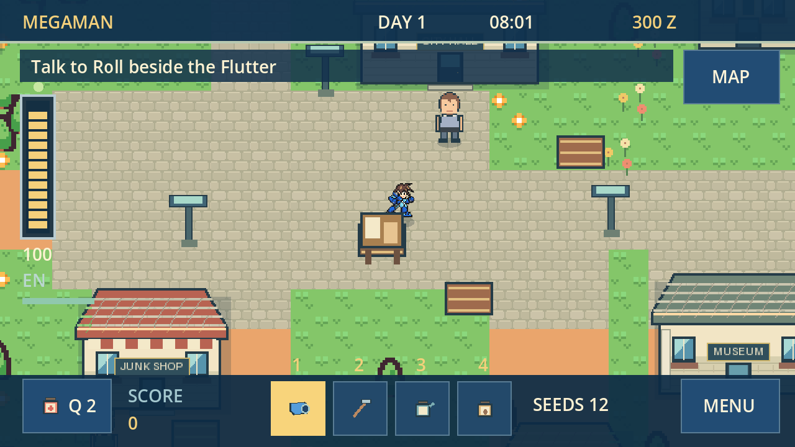
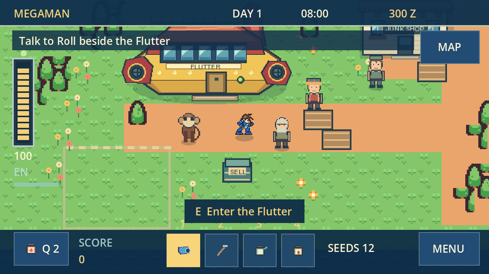
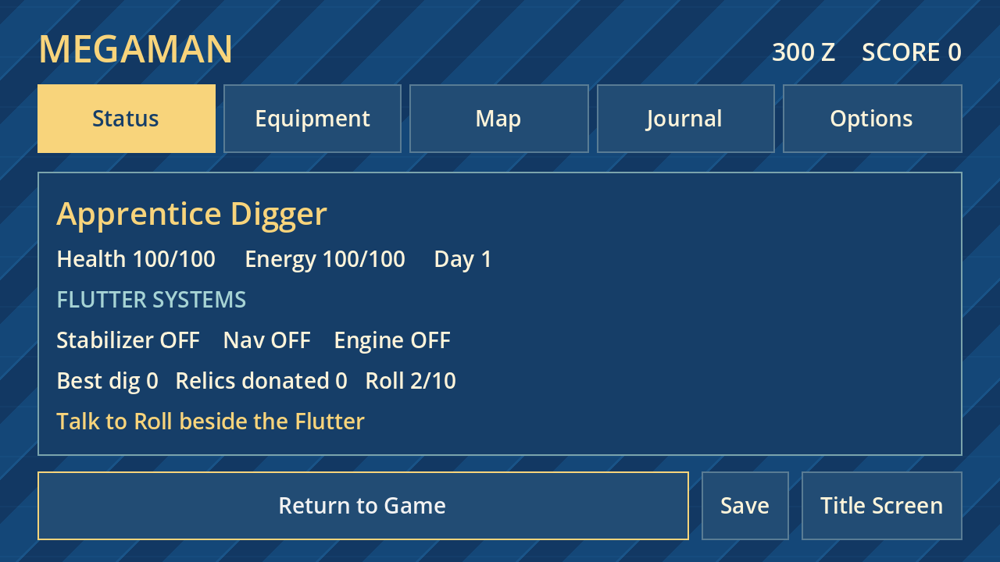

# Mega Man Legends: Kattelox Days

A playable, non-commercial Mega Man Legends fan game with a Stardew-inspired daily rhythm. The Flutter crash-lands on Kattelox, becomes your home, and needs three salvaged systems to fly again. Build a life on the surface, earn Zenny, upgrade your Buster with Roll, explore the northern ruins and face the Bonnes.

**Version 0.2.0: the first chapter is playable from the crash to the ending, with continued town life and a Deep Dig challenge after the repairs.**



## Play on Windows

Download `KatteloxDays-Windows` from the latest successful [build workflow](https://github.com/myplexscripts/mml/actions/workflows/godot-check.yml), extract the ZIP and open `KatteloxDays.exe`. The exported game includes its assets and does not require Godot, Python or Docker.

To run the source, open `project.godot` with **Godot 4.7.2** and press F5. The title screen offers a new adventure or Continue. New Adventure asks before replacing an existing save.

## What is playable

- A detailed pixel-art Kattelox town with the Flutter, crew cabin, City Hall, Junk Shop, museum, cafe, police station, homes, garden, request board, shoreline and ruin lift.
- Recognisable MegaMan animation, Roll, Data, Barrell, Amelia, Tron and the Junk Shop Man. Town characters follow daily schedules; daily conversations improve friendship and unlock Roll's seed gifts.
- Real CharacterBody2D collision and sliding, wall-aware enemy navigation, swept projectile collision, knockback, dash invulnerability, attack telegraphs, lock-on, health, armour, healing and defeat recovery.
- Three distinct ruin layouts, Horokko, Zakobon, Sharukurusu, guardians, a Bonne mech showdown, Servbots, guarded caches and a complete Flutter repair campaign.
- Buster power, rapid-fire and armour upgrades; Zenny and scrap drops with gravity, bounce and collection; score, combos, Digger ranks and best-dig tracking.
- Twelve farm plots with hoeing, seeds, watering and three watered nights of growth; turnip harvesting, fishing timing challenges, shipping, daily requests, a relic museum and cafe or galley meals.
- Day/night lighting, rainy days, restored energy after sleep, a daily summary and persistent progress.
- Legends-inspired blue and gold menus, segmented health, equipment, a location map, objective journal and the animated scrolling pause background. Options include music, sound effects and reduced motion.
- Three original looping music tracks, original garden/UI Foley and attributed Legends sound effects.



## Controls

| Action | Keyboard / mouse | Gamepad |
| --- | --- | --- |
| Move | WASD / arrows | Left stick |
| Interact / advance dialogue | E, F, Space / Enter in menus | A |
| Fire Buster | Hold J / left click to aim | X |
| Lock onto a visible enemy | Hold K / right click | Left shoulder |
| Dash | Shift | Right shoulder |
| Use an energy bottle | Q | Y |
| Tools | 1 Buster, 2 hoe, 3 watering can, 4 seeds; T cycles | Click tool buttons |
| Pause / return | Esc / MENU | Start |
| Map / equipment | M / Tab | Pause tabs |
| Sleep near or inside the Flutter | R / interact with bunk | Interact with bunk |
| Fullscreen | F11 | Window controls |

E also handles the garden's next step: till an empty plot, plant a seed, water it, or harvest a mature turnip. In combat areas the Buster equips automatically. Hold lock-on and fire while moving; dash through telegraphed attacks. Gardens and town services are usable from the first day.

## The repair chapter

1. Speak to Roll beside the Flutter to receive the repair plan.
2. Enter the northern lift and clear the stabilizer chambers. Recover the Servo Motor and bring it to Roll.
3. Explore the navigation vault, defeat its guardian and return the Ancient Circuit.
4. Meet Tron in the plaza and defeat the Bonne machine.
5. Enter the Refractor core, defeat the final guardian and recover the Large Refractor.
6. Deliver it to Roll for the ending. Keep playing in town or try a Deep Dig run.

Taking a break to garden, fish, help neighbours and buy upgrades makes the next dig easier. Defeat costs a small amount of Zenny and returns you safely home; repair parts stay with you.

## Saves

Version 2 saves use Godot's `user://kattelox_days_v2.json`. Windows stores this in the game's folder under `%APPDATA%/Godot/app_userdata/`. Data, sleep, the pause menu, area travel, story milestones and the 45-second autosave all save progress. Continue restores equipment, inventory, crops, friendship, daily requests and repair progress, and starts you safely beside the Flutter.

This version uses a separate save from the older prototype. Its old save is preserved. Browser saves belong to the browser and origin where the Web build runs.

## Build and validation

Godot 4.7.2, GDScript, a 640 x 360 logical canvas, nearest-neighbour pixel art and the GL compatibility renderer. Windows is the main target; a single-threaded WebGL 2 build is provided for browser testing.

```sh
python tools/check_game.py --godot godot --export
```

The checked-in workflow imports and parses the project, runs a main-scene smoke check, executes gameplay regression tests, plays the Bonne fight using ordinary movement/fire inputs, and exports Windows and Web artifacts. Runtime errors fail validation even if Godot returns exit code zero. See [validation](docs/VALIDATION.md) and [asset provenance](docs/ASSETS.md).

Art and music are already bundled. `tools/build_art.py` (Pillow) and `tools/build_audio.py` (NumPy and ffmpeg) rebuild the original/derived assets; they are development tools only.



## Credits

Mega Man Legends and its characters, setting and related designs belong to Capcom. This is an unofficial fan project and implies no endorsement. Original Seeteufel the Mighty fan sprites are credited to its authors, and CC0 terrain is by Kenney. Detailed credits and source links are in [ASSETS.md](docs/ASSETS.md).
