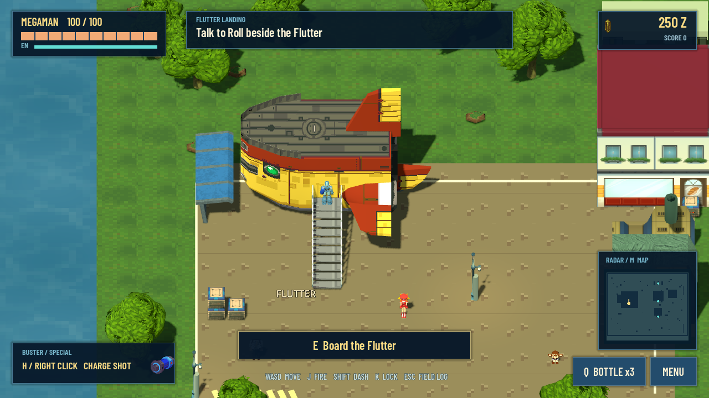
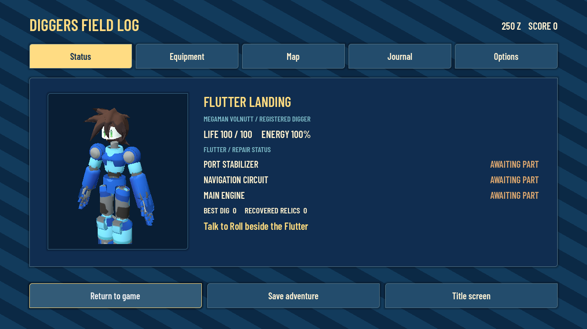
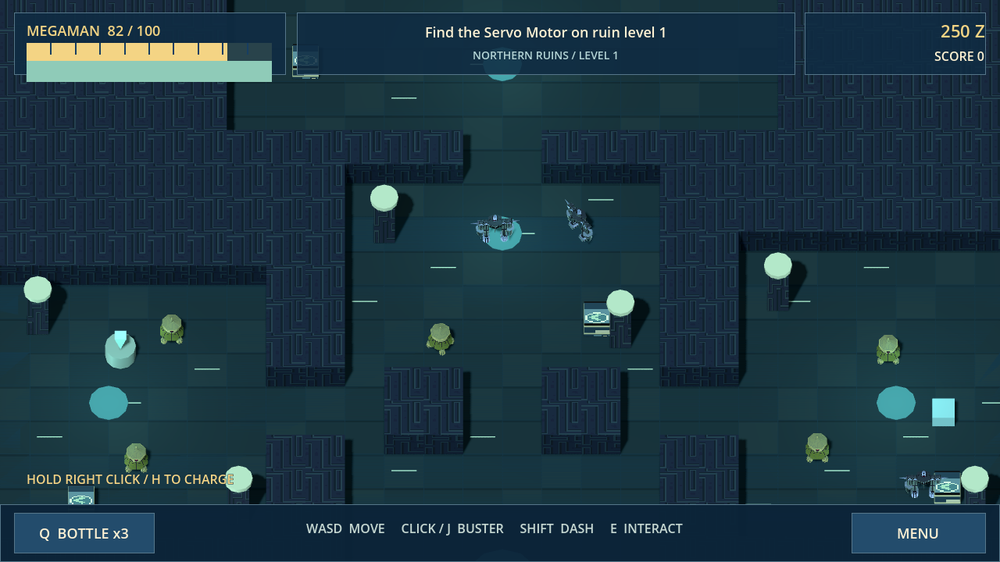
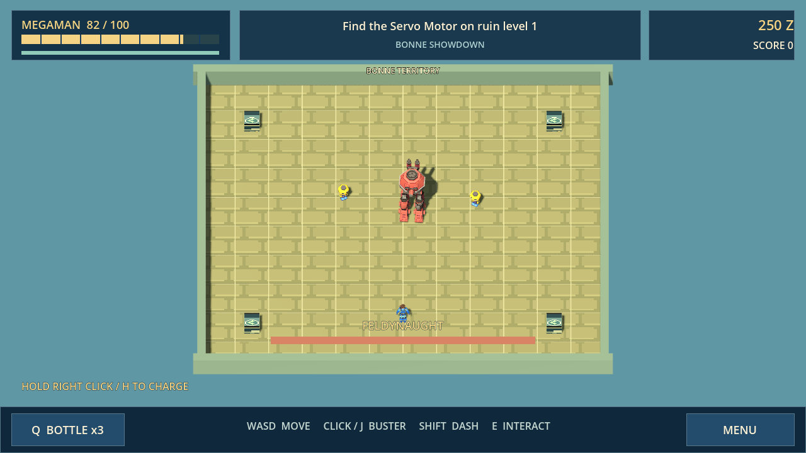

# Mega Man Legends: Flutterbound

A top-down Mega Man Legends fan adventure. Explore connected ruins, fight Reaverbots and Bonne machinery, salvage upgrades and return to your crew aboard the Flutter. Version **0.6.1** replaces the farming prototype with a focused action game using textured 3D models and an overhead camera.



## Play

Download **Flutterbound-Windows** from the latest successful [build workflow](https://github.com/myplexscripts/mml/actions/workflows/godot-check.yml), extract it and open `Flutterbound.exe`. No engine installation is needed. The Web build requires an HTTP server and a WebGL 2 browser. Open the source in **Godot 4.7.2** and press F5 to develop or play it.

Version 0.6 replaces the broken character import with joshmnky's textured, animated Volnutt model and a source Buster attached to its hand. The larger landed Flutter has a measured hatch connection, continuous stair collision and solid rails. Textured Teomo City scenery supplies trees, lamps, boats, the junk shop and a converted warehouse bay. Original MML interface sprites, music and sound effects replace more placeholders. Crates, ships, buildings, rocks, trees and furniture have collision; tall scenery fades when it hides the player. Existing Flutterbound saves remain compatible.



The 0.6.1 finishing pass removes collected items' collision and navigation obstacles, blocks interactions through walls, recovers unexpected falls below the map, cancels pending charges and dashes when opening menus, and adds a native Quit button.

## The adventure

Talk to Roll beside the Flutter and choose **Check Flutter repairs**. Recover the Servo Motor from the western chamber on level 1, defeat the Hanmuru Doll for level 2's Ancient Circuit, face Tron's Feldynaught and retrieve the Large Refractor from level 3. Bring each part home to Roll. Completing the chapter opens advancing Deep Digs with stronger guardians and larger rewards.

The Flutter is your home base. Board its furnished cabin, rest in the bunk, visit Roll's workbench and chat with the crew. Data restores health and saves. Break salvage crates for scrap, shards and Zenny. Find the eastern weapon plans to build a bouncing Grenade Arm. Buy Buster power, rapid fire, armour and energy bottles between expeditions.

Combat has independent movement and aiming, visible-enemy lock-on, charged shots, invulnerable dashes, windup telegraphs, radial boss attacks, summoned minions, knockback, physical loot and chain scoring. CharacterBody3D collision, wall-aware navigation, swept projectile rays and rigid-body grenades govern actual movement and hits. The blue-and-gold pause menu includes a scrolling background, equipment, an area map, journal and audio/motion options.



## Controls

| Action | Keyboard / mouse | Controller |
| --- | --- | --- |
| Move / aim | WASD or arrows / mouse | Left / right stick |
| Fire | Hold left click or J | X |
| Charged Buster | Hold right click or H, then release | Hold RT, then release |
| Lock on | Hold K | LB |
| Dash | Shift | RB |
| Interact / dialogue | E, F or Space | A |
| Grenade Arm | L after crafting | B |
| Energy bottle | Q | Y |
| Pause | Esc or Menu | Start |
| Map / equipment | M / Tab | Pause tabs |
| Camera zoom | Mouse wheel | Mouse / saved preference |
| Fullscreen | F11 | Window controls |

## Saves

`user://flutterbound_v1.json` stores repair progress, equipment, inventory, score and options. Data, the bunk, travel, story milestones, the pause menu and a 40-second autosave save progress. Continue starts safely beside the Flutter. Defeat returns you home for an 8% Zenny repair fee and retains recovered parts. A new adventure asks before replacing this save. Older Kattelox Days saves remain separate and are not migrated. Browser saves belong to the browser and origin.

## Build and checks

```sh
python tools/check_game.py --godot godot --export
python tools/package_game.py
```

The workflow runs campaign and physics regressions, a normal-input Bonne combat playtest, both exports and resource-pack checks from an empty project. `tools/browser_check.cjs` separately checks WebGL rendering, controls and IndexedDB persistence using Playwright. See [validation](docs/VALIDATION.md).



This is a playable fan-game chapter, not a recreation of the full original games. Crew and machinery use attributed model resources; the maps are authored for this project around imported scenery, and Volnutt uses an authored run animation. Windows exports are checked as self-contained packs, but native Windows execution has not been tested here.

Mega Man Legends and related characters/designs belong to Capcom. Textured rips are contributed by **Xinus22**, using **Kion**'s tools; the animated Volnutt is by **joshmnky** and Teomo scenery by **tutsyroll / maximize**, through Sky Pirate Arcade / Legends Station. Full source and audio credits: [ASSETS.md](docs/ASSETS.md). Unofficial, non-commercial fan project.
