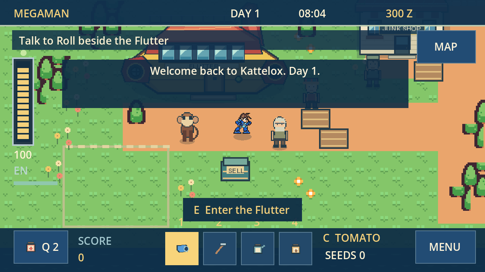

# Version 0.3.0 validation

Validated with Godot 4.7.2 on 5 October 2026.

| Check | Result |
| --- | --- |
| Fresh project import and GDScript parse | Pass, no script errors |
| Real main-scene startup and normal shutdown | Pass |
| Campaign regression suite | 37 passed, 0 failed |
| Expansion regression suite | 37 passed, 0 failed |
| Bonne fight using normal movement, lock-on, dash and Buster inputs | Pass with the basic Buster, 68 health and both starting bottles remaining |
| Native rendered visual review | Title, dialogue, Flutter, town, all five pause tabs, shop, home, cabin, four furnished town interiors, mature crops, seed selection, ruins, ruin map, Bonne arena and fishing reviewed; no controls outside the logical viewport |
| Browser playtest | Pass in Chromium 154 with WebGL 2: title, opening dialogue, tomato seed selection, movement, equipment, IndexedDB save, reload and Continue; zero browser/runtime errors |
| Windows x86_64 export | Pass; embedded resource pack included |
| Single-threaded Web export | Pass; WebAssembly, JavaScript, audio support and resource pack included |
| Exported pack test from an empty project | Both packs independently start the title, town, ruins, Bonne arena, cabin and all four new interiors with bundled sprites and music; development tools/tests excluded |
| ZIP integrity and payload hashes | Pass; packaged executable/resource pack match the final exports |

The regression suite tests building collision and wall sliding, swept projectile wall/body collision, pause freezing, damage invulnerability, dash protection, scoring, watered crop growth, harvest and shipping prices, duplicate request prevention, ruin navigation, guarded caches, each repair unlock, immediate Tron appearance, the ending, cabin access, upgrades, healing, fishing, save restoration and sleeping. Quest regression steps explicitly defeat enemies to test story progression. The separate Bonne test plays the fight without damage overrides, enemy freezes, stat cheats or combat teleports.

Visual testing found and fixed a wrapping dialogue hint, overflowing journal content, overlaid effects, uneven road tiles and an arena camera that hid the Bonne machine. Story testing found and fixed Tron appearing only after rebuilding the town. Combat entry now equips the Buster automatically.

The expansion suite also loads a literal v0.2 save, walks into each shop counter to test collision, returns through each doorway, harvests and regrows tomatoes, checks produce prices and daily gift limits, shoots and collects physical salvage, tests claimed crates across re-entry, crafts the Grenade Arm at its exact cost, tests energy/cooldown, grenade gravity and wall bounce, paused fuses and splash occlusion, checks three connected Deep Dig layouts and verifies increasing cache rewards and saved progress.

Rendered review found and fixed crops being covered by soil, rugs covering character feet, narrow inventory columns and museum exhibits drawing behind their glass cases. Scrollable menus intentionally clip offscreen rows and keep their Back button visible.

## Reproduce

```sh
python tools/check_game.py --godot godot --export
```

This runs the checks used by `.github/workflows/godot-check.yml`; logs are written to `build/check-*.log`. Gameplay tests use isolated user data and do not modify a player's save. Headless runs load audio resources without starting silent playback jobs; native and browser builds use normal audio playback. Godot 4.7.2 export templates are required only for `--export`.

For the optional browser check, install Playwright, set `CHROMIUM_PATH` to a compatible Chromium executable and run `node tools/browser_check.cjs` after exporting. It uses a fresh browser context and asserts the tomato selection exists in the saved IndexedDB record. `python tools/package_game.py` builds and verifies the downloadable ZIPs.

For native screenshots, run `tests/visual_check.gd` with a graphical Godot session. It writes ignored `test-results/` images. For a standalone pack check, run `tests/export_pack_test.gd` from an empty project and pass the absolute exported EXE/PCK path after `--`.

The Windows build was exported and its embedded resources checked in this Linux session; native execution on Windows was not available. Hardware gamepad testing was not performed. Browser save persistence was tested across reload, including returning through Continue.


